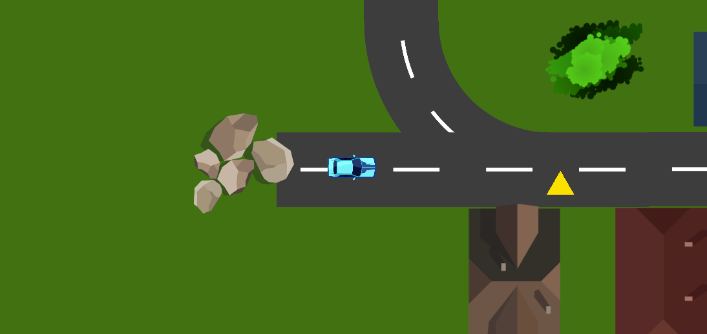

# Delivery-Driver

This 2D Game was created in Unity engine according to the course on Udemy.com

In this game, it is possible to move around the map using the arrow keys on the keyboard. The main goal of the game is to deliver shipments to customers located in various locations on the map. If the player will ride through the green square on the map, the color of the vehicle will change, which represents receiving the shipment. Subsequently, the player must drive with vehicle through the orange circle, which represents the customer. There are also a yellow triangles on the game map that increases the speed of the vehicle. Conversely, a red square slows down the vehicle. Collisions are enabled in the game, so it is not possible to pass through objects such as houses, trees, stones and other cars. In the event of an impact, the vehicle slows down again.

## Screenshoots

